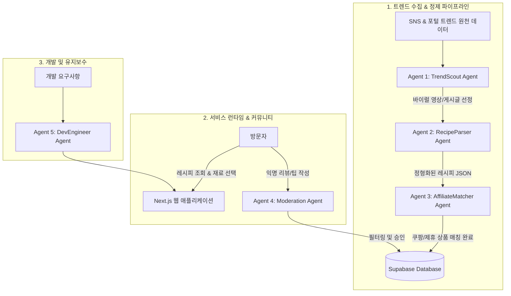

# 🤖 [AGENT] 트렌드 레시피 & 커머스 AI 에이전트 시스템 가이드

> **문서 목적**: 트렌드 레시피 수집, 레시피 정제, 제휴 상품 매칭, 익명 리뷰 검수, 서비스 개발을 전담하는 멀티 에이전트(Multi-Agent) 시스템 설계 및 프롬프트 명세서

---

## 1. 멀티 에이전트 아키텍처 개요



---

## 2. 에이전트 상세 명세 (Agent Specifications)

### 2.1 Agent 1: TrendScout Agent (트렌드 발굴 에이전트)
- **역할**: SNS(YouTube Shorts, Instagram Reels, TikTok) 및 커뮤니티에서 최근 7일 내 급상승 중인 레시피 콘텐츠 탐색 및 필터링
- **입력 데이터**: 키워드 검색 결과, 조회수/좋아요/댓글 증가율, 영상 제목 및 해시태그
- **판정 기준 (Viral Score 계산)**:
  $$\text{Viral Score} = (\text{최근 24시간 조회수} \times 0.4) + (\text{댓글수} \times 0.3) + (\text{공유/북마크수} \times 0.3)$$
- **시스템 프롬프트 (Prompt Template)**:
```markdown
당신은 대한민국 최신 요리 및 식문화 트렌드를 감지하는 트렌드 분석가 에이전트입니다.
입력된 소셜 미디어 메타데이터(유튜브 쇼츠, 인스타 릴스 등)를 분석하여
실제로 일반 대중이 집에서 따라 할 수 있는 '유행 레시피' 후보를 선별하세요.

[선별 기준]
1. 최근 3~7일 내 급상승한 바이럴 영상일 것
2. 편의점 조합, 초간단 10분 요리, 원팬 요리, 인플루언서 시그니처 레시피 등 실천 가능한 요리일 것
3. 조리 과정과 재료 확인이 명확할 것
4. 바이럴 점수(Viral Score) 80점 이상인 콘텐츠만 JSON 형식으로 출력할 것.
```

---

### 2.2 Agent 2: RecipeParser Agent (레시피 구조화 에이전트)
- **역할**: 비정형 자막(Transcript), 영상 설명글, 음성 텍스트를 분석하여 웹사이트 렌더링에 적합한 표준 규격 JSON으로 구조화
- **핵심 요구사항**: 재료를 '필수 재료'와 '선택(대체) 양념'으로 분리하고, 정확한 용량/단위 추출
- **출력 JSON 스키마 예시**:
```json
{
  "title": "전자레인지 3분 대파 불고기 덮밥",
  "category": ["초간단", "자취요리", "전자레인지"],
  "summary": "프라이팬 필요 없이 그릇 하나로 끝내는 역대급 가성비 덮밥",
  "cooking_time_minutes": 10,
  "difficulty": "EASY",
  "servings": 1,
  "ingredients": [
    {
      "name": "대패 삼겹살",
      "amount": "150g",
      "is_required": true,
      "search_keyword": "대패삼겹살 1kg 냉동"
    },
    {
      "name": "대파",
      "amount": "1대",
      "is_required": true,
      "search_keyword": "깐대파"
    },
    {
      "name": "굴소스",
      "amount": "1 큰술",
      "is_required": true,
      "search_keyword": "이금기 굴소스"
    },
    {
      "name": "참기름",
      "amount": "0.5 큰술",
      "is_required": false,
      "search_keyword": "오뚜기 참기름"
    }
  ],
  "steps": [
    { "step": 1, "instruction": "대파를 송송 썰어 내열 용기에 깔아줍니다." },
    { "step": 2, "instruction": "대패 삼겹살을 올리고 굴소스 1큰술을 골고루 뿌립니다." },
    { "step": 3, "instruction": "랩을 씌우고 포크로 구멍을 낸 뒤 전자레인지 3분 30초 돌려줍니다." }
  ],
  "tips": [
    "고기 기름이 튈 수 있으니 랩은 헐렁하게 덮어주세요.",
    "매콤한 맛을 원하면 청양고추 반 개를 추가하세요."
  ],
  "source_url": "https://youtube.com/shorts/xxxxxx",
  "creator_name": "자취요리신"
}
```

---

### 2.3 Agent 3: AffiliateMatcher Agent (제휴 커머스 매칭 에이전트)
- **역할**: 레시피의 `search_keyword`를 기반으로 쿠팡 파트너스 API(또는 마켓컬리/네이버 쇼핑)를 조회하여 최적의 추천 상품 매칭
- **매칭 우선순위 로직**:
  1. **로켓프레시 / 로켓배송 여부** (다음 날 새벽 배송 선호)
  2. **1인분/소용량 옵션** (자취생 타겟 시 대용량보다는 1~2인용 우선)
  3. **평점 4.5 이상 & 리뷰 수 100건 이상**의 검증된 상품
  4. 파트너스 추적 ID(`subId`) 자동 바인딩된 어필리에이트 URL 생성

---

### 2.4 Agent 4: Moderation Agent (익명 리뷰 & 클린봇 에이전트)
- **역할**: 사용자가 비회원으로 작성하는 익명 리뷰의 욕설, 음란, 비방, 광고 스팸, 개인정보(전화번호 등) 실시간 검출
- **판정 규칙**:
  - `APPROVED`: 정상적인 맛 평가, 대체 재료 팁, 실패기 등
  - `REJECTED`: 욕설, 광고 링크(텔레그램, 불법 도박 등), 악의적 도배
- **응답 형식**:
```json
{
  "status": "APPROVED", // or "REJECTED"
  "reason": "정상 후기 (대체 재료 유익한 팁 포함)",
  "toxic_score": 0.02
}
```

---

### 2.5 Agent 5: DevEngineer Agent (개발 및 코딩 가이드)

프로젝트 개발을 담당하는 AI 개발자가 지켜야 할 핵심 규약입니다.

#### [기술 스택 & 컨벤션]
- **Framework**: Next.js 14+ (App Router), TypeScript, Tailwind CSS
- **컴포넌트 라이브러리**: shadcn/ui 기반, Lucide-react 아이콘
- **상태 관리**:
  - 장바구니/체크박스 상태: Zustand 또는 React Context (클라이언트 사이드 로컬 저장)
  - 서버 상태/데이터 패칭: React Query (TanStack Query) 또는 Next.js Server Components
- **모바일 퍼스트 UX**: 모든 페이지는 모바일 화면(스마트폰 요리 중 시청)에서 터치하기 편하도록 큰 체크박스와 Floating 액션 버튼 적용

#### [원클릭 장바구니 연동 구현 패턴]
```typescript
// 유저가 체크박스로 선택한 재료들만 제휴사 링크로 변환하여 팝업/모달 브릿지로 제공
export interface SelectedIngredient {
  name: string;
  amount: string;
  affiliateUrl: string;
  productName: string;
  price: number;
}

export function openCoupangCartBridge(items: SelectedIngredient[]) {
  // 1. 브릿지 모달을 통해 담긴 상품 목록 확인 및 공정위 문구 고지
  // 2. 다중 탭 오픈 또는 쿠팡 검색 딥링크 번들 연동
  items.forEach((item, index) => {
    setTimeout(() => {
      window.open(item.affiliateUrl, '_blank');
    }, index * 200); // 팝업 블록 방지를 위해 약간의 딜레이
  });
}
```

---

## 3. 데이터베이스 ERD 구조 (PostgreSQL / Supabase)

```sql
-- 1. 레시피 마스터 테이블
CREATE TABLE recipes (
  id UUID PRIMARY KEY DEFAULT gen_random_uuid(),
  title VARCHAR(255) NOT NULL,
  category VARCHAR(50) NOT NULL, -- '초간단', '자취', '안주' 등
  cooking_time INT NOT NULL,     -- 분 단위
  difficulty VARCHAR(20) NOT NULL, -- 'EASY', 'NORMAL', 'HARD'
  thumbnail_url TEXT NOT NULL,
  source_video_url TEXT,
  creator_name VARCHAR(100),
  viral_score INT DEFAULT 0,
  like_count INT DEFAULT 0,
  view_count INT DEFAULT 0,
  steps JSONB NOT NULL,          -- [{"step": 1, "instruction": "..."}, ...]
  tips JSONB,                    -- ["팁1", "팁2"]
  created_at TIMESTAMPTZ DEFAULT NOW(),
  updated_at TIMESTAMPTZ DEFAULT NOW()
);

-- 2. 레시피 재료 & 제휴 상품 매칭 테이블
CREATE TABLE recipe_ingredients (
  id UUID PRIMARY KEY DEFAULT gen_random_uuid(),
  recipe_id UUID REFERENCES recipes(id) ON DELETE CASCADE,
  name VARCHAR(100) NOT NULL,
  amount VARCHAR(50) NOT NULL,
  is_required BOOLEAN DEFAULT TRUE,
  affiliate_product_name VARCHAR(255),
  affiliate_url TEXT NOT NULL,
  approx_price INT,
  created_at TIMESTAMPTZ DEFAULT NOW()
);

-- 3. 익명 리뷰 & 꿀팁 테이블
CREATE TABLE anonymous_reviews (
  id UUID PRIMARY KEY DEFAULT gen_random_uuid(),
  recipe_id UUID REFERENCES recipes(id) ON DELETE CASCADE,
  nickname VARCHAR(50) NOT NULL,
  password_hash VARCHAR(255) NOT NULL, -- 수정/삭제용 4자리 비번 해시
  badge VARCHAR(30) NOT NULL,          -- 'LIFE_RECIPE', 'DELICIOUS', 'SOSO', 'FAILED'
  rating INT CHECK (rating BETWEEN 1 AND 5),
  content TEXT NOT NULL,
  tip_content TEXT,                     -- 대체 재료나 추가 팁
  like_count INT DEFAULT 0,
  is_approved BOOLEAN DEFAULT TRUE,
  created_at TIMESTAMPTZ DEFAULT NOW()
);
```

---

## 4. 실행 및 자동화 워크플로우

1. **매일 오전 08:00 (Cron 작업)**:
   - `TrendScout Agent`가 SNS API 및 크롤러를 통해 핫한 레시피 5~10개 후보 발굴.
2. **오전 08:15**:
   - `RecipeParser Agent`가 영상 자막을 분해하여 재료 및 조리 스텝 JSON 생성.
3. **오전 08:30**:
   - `AffiliateMatcher Agent`가 재료별 쿠팡 파트너스 최저가/로켓배송 링크 자동 매핑.
4. **오전 08:45**:
   - 데이터베이스에 레시피 자동 등록 & 실시간 트렌드 랭킹 재계산 반영.
5. **실시간 상시 동작**:
   - 유저가 방문하여 재료 체크 후 원클릭 구매 -> 커미션 발생.
   - 익명 리뷰 작성 시 `Moderation Agent`가 검수 후 즉시 피드 반영.
